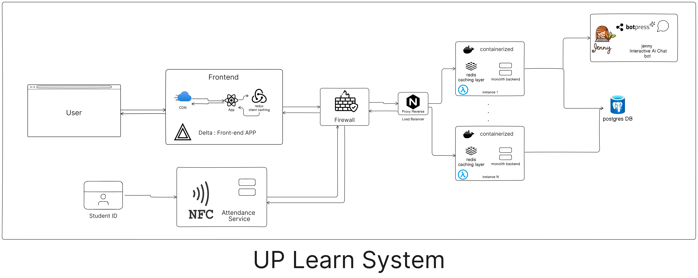

# Learning Management System (LMS) - Graduation Project

  
  

  

     

      
 

 

Welcome to our Learning Management System (LMS) project! This system is designed to streamline and enhance the learning experience for both students and educators. This project is specifically developed as the graduation project for students in the Mathematics department at the Faculty of Science, Cairo University.

## 🚀 Features:

- **User-Friendly Interface:** Intuitive design for easy navigation.
- **Course Management:** Create, organize, and manage courses effortlessly.
- **User Roles:** Define roles for students, instructors, and administrators.
- **Assignment Submission:** Students can submit assignments online.
- **Grading System:** Efficient grading tools for instructors.
- **Real-time Communication:** Instant messaging for seamless student-teacher interaction.

## 🧰 Tech Stack:

- Java
- Spring boot
- Postgres
- HTML, CSS, JavaScript
- React
- Vite

## 🛠️ Tools:

- Docker
- Kubarnates
- Jenkins
- Nginx

## 🏗️ System Architecture

  

Our LMS (UPLern) is designed as a **monolithic architecture** with modular responsibilities and scalability in mind. Below is a breakdown of the system's core components:

- **Delta (Frontend)**: Built with **React** and **Vite**, it provides a responsive, user-friendly interface for students, instructors, and administrators.
- **Firewall Layer**: Handles access control and security filtering before requests reach core services.
- **Nginx**: Acts as a **reverse proxy**, managing traffic, load balancing across backend instances, and serving static files via CDN.
- **Lambda (Backend Services)**: Multiple instances of a **Java Spring Boot** backend handle core business logic such as user authentication, role-based access, registration, grading, announcements, and internal communication.
- **PostgreSQL**: Relational database storing users, courses, classes, schedules, messages, and performance data.
- **Redis**: Caching layer for sessions, frequent queries, and real-time event handling.
- **Jenny (AI Chatbot)**: Built with **Botpress**, Jenny helps students with FAQs, navigation, and learning support.
- **NFC Attendance Service**: A micro-service handling **NFC-based check-ins** to automate class attendance.

The architecture supports real-time communication using **WebSocket** and **Server-Sent Events (SSE)**, with a focus on speed, modularity, and reliability.

## 📽️ Project Presentation

> [Click here to watch the project presentation](https://www.canva.com/design/DAGJnM21mcQ/VHZul6l3XjXjzWaSDHOpQg)

## 📚 Full Documentation

> [Read the full system documentation](../docs/Uplearn_Gp_Document.pdf)

## 🌐 Landing Page

> [visit our landing page](https://uplearn-a6c00.web.app/)

## 🔗 Useful Links:

- [DOCS](../docs/Uplearn_Gp_Document.pdf)
- [Documentation Wiki](https://github.com/gp-lms-sci-cu-24/wiki)
- [Slack Channel](https://join.slack.com/t/graduationprojectlms/shared_invite/zt-2ddps1l2p-v2ST3WOaOOvOmfIriL5VaA) - Join our Slack community for real-time discussions.
- [Trello Board](https://trello.com/invite/graduationprojectlms/ATTI60f36808f858128dd0c880228aff1288D5A037B9) - Track project progress and tasks on our Trello board.
- [Notion Workspace](https://www.notion.so/Graduation-Project-cf2b59c49c5447829e59cc5e111964ac?pvs=4) - Collaborate and access project-related documents on Notion.
  We welcome contributions! Feel free to fork the project, make improvements, and create pull requests. If you encounter any issues or have suggestions, please open an [issue](https://github.com/gp-lms-sci-cu-24/issues). Happy learning!

## Collaborators:

| Code    | Name             | GitHub Account                                           | Email                       |
| ------- | ---------------- | -------------------------------------------------------- | --------------------------- |
| 2027453 | Mahmoud Atef     | [@Mahmoudbakar2002](https://github.com/Mahmoudbakar2002) | mahmoudatef.coder@gmail.com |
| 2027115 | Mohamed Atef     | [@hngara](https://github.com/hngara)                     | mohamedshata9898@gmail.com  |
| 2027069 | Abdallah Mohamed | [@Abdallah85](https://github.com/Abdallah85)             | abdallah.moh.153@gmail.com  |
| 2027220 | Hazem Mohamed    | [@hazemmuuhammed](https://github.com/hazemmuuhammed)     | hazemmuuhammed@gmail.com    |
| 1928275 | Ahmed Hany       | [@HNOONa-0](https://github.com/HNOONa-0)                 | hanyahmed11811@gmail.com    |
| 2027471 | Omar Kenawi      | [@omarKenawi](https://github.com/omarKenawi)             | omar.sseeddeekk@gmail.com   |
| 1927194 | Muhammed Walied  | [@Muhammed-Walied](https://github.com/Muhammed-Walied)   | mohamedwalied248@gmail.com  |
